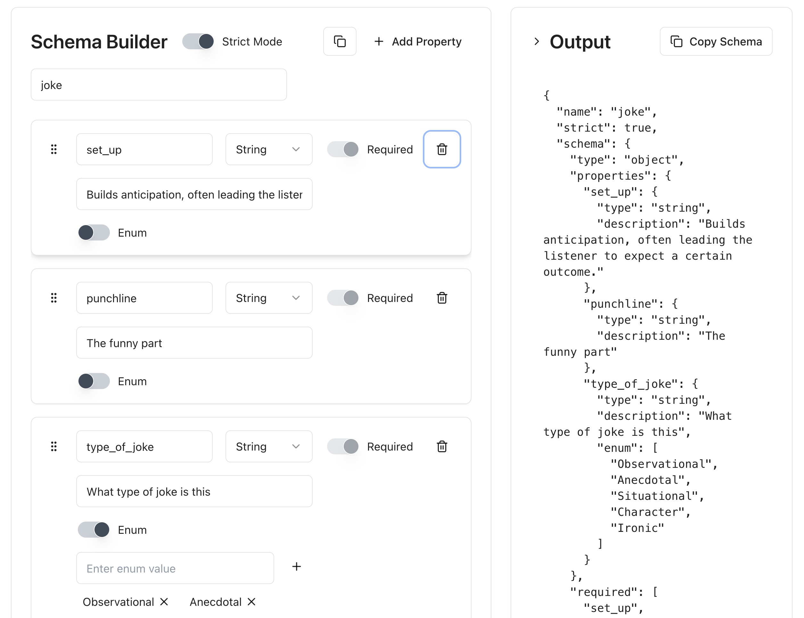

# JSON Schema Builder

[Live Demo](https://baicheng-miq.github.io/json-schema-builder/)

A modern, interactive UI tool for building JSON Schema definitions for structured outputs. Perfect for creating schemas used with [OpenAI's structured output feature](https://platform.openai.com/docs/guides/structured-outputs).



## Features

- Drag-and-drop interface for organizing schema properties
- Support for string, number, boolean, object, and array property types
- Enum value management for properties
- Strict mode toggle for enforcing required properties
- Real-time schema validation
- Copy-to-clipboard functionality for the generated schema
- Responsive design using TailwindCSS
- Generate schemas compatible with OpenAI structured output requirements

## Technologies Used

- React 19
- TypeScript
- TailwindCSS
- DND Kit for drag-and-drop functionality
- Vite for fast development and building

## Getting Started

### Prerequisites

- Node.js (v18 or later recommended)
- npm or yarn

### Installation

1. Clone the repository:
   ```bash
   git clone https://github.com/Baicheng-MiQ/json-schema-builder.git
   cd json-schema-builder
   ```

2. Install dependencies:
   ```bash
   npm install
   # or
   yarn
   ```

3. Start the development server:
   ```bash
   npm run dev
   # or
   yarn dev
   ```

## Usage

1. Add properties using the "Add Property" button
2. Configure each property with name, type, and other options
3. Toggle "Strict Mode" to enforce required properties
4. Use drag-and-drop to reorder properties
5. View the generated JSON Schema in real-time
6. Copy the schema to clipboard using the Copy button

## Building for Production

```bash
npm run build
# or
yarn build
```

The built files will be in the `dist` directory, ready to be deployed.

## License

[MIT](LICENSE)
